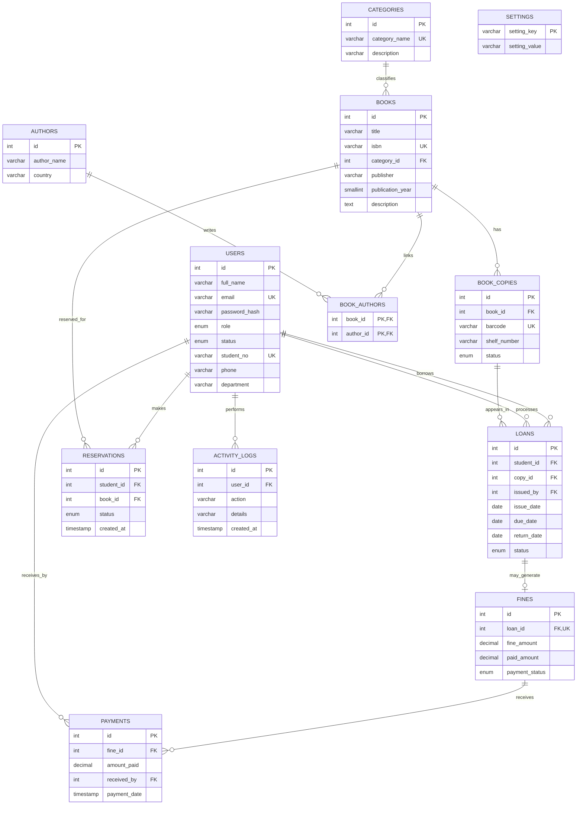

# ER Diagram (Mermaid)

```mermaid
erDiagram
    USERS ||--o{ LOANS : borrows
    USERS ||--o{ RESERVATIONS : makes
    USERS ||--o{ ACTIVITY_LOGS : performs
    USERS ||--o{ LOANS : processes
    CATEGORIES ||--o{ BOOKS : classifies
    BOOKS ||--o{ BOOK_COPIES : has
    BOOKS ||--o{ BOOK_AUTHORS : links
    AUTHORS ||--o{ BOOK_AUTHORS : writes
    BOOK_COPIES ||--o{ LOANS : appears_in
    LOANS ||--o| FINES : may_generate
    FINES ||--o{ PAYMENTS : receives
    USERS ||--o{ PAYMENTS : receives_by
    BOOKS ||--o{ RESERVATIONS : reserved_for

    USERS {
      int id PK
      varchar full_name
      varchar email UK
      varchar password_hash
      enum role
      enum status
      varchar student_no UK
      varchar phone
      varchar department
    }
    CATEGORIES {
      int id PK
      varchar category_name UK
      varchar description
    }
    AUTHORS {
      int id PK
      varchar author_name
      varchar country
    }
    BOOKS {
      int id PK
      varchar title
      varchar isbn UK
      int category_id FK
      varchar publisher
      smallint publication_year
      text description
    }
    BOOK_AUTHORS {
      int book_id PK,FK
      int author_id PK,FK
    }
    BOOK_COPIES {
      int id PK
      int book_id FK
      varchar barcode UK
      varchar shelf_number
      enum status
    }
    LOANS {
      int id PK
      int student_id FK
      int copy_id FK
      int issued_by FK
      date issue_date
      date due_date
      date return_date
      enum status
    }
    RESERVATIONS {
      int id PK
      int student_id FK
      int book_id FK
      enum status
      timestamp created_at
    }
    FINES {
      int id PK
      int loan_id FK,UK
      decimal fine_amount
      decimal paid_amount
      enum payment_status
    }
    PAYMENTS {
      int id PK
      int fine_id FK
      decimal amount_paid
      int received_by FK
      timestamp payment_date
    }
    SETTINGS {
      varchar setting_key PK
      varchar setting_value
    }
    ACTIVITY_LOGS {
      int id PK
      int user_id FK
      varchar action
      varchar details
      timestamp created_at
    }
```
